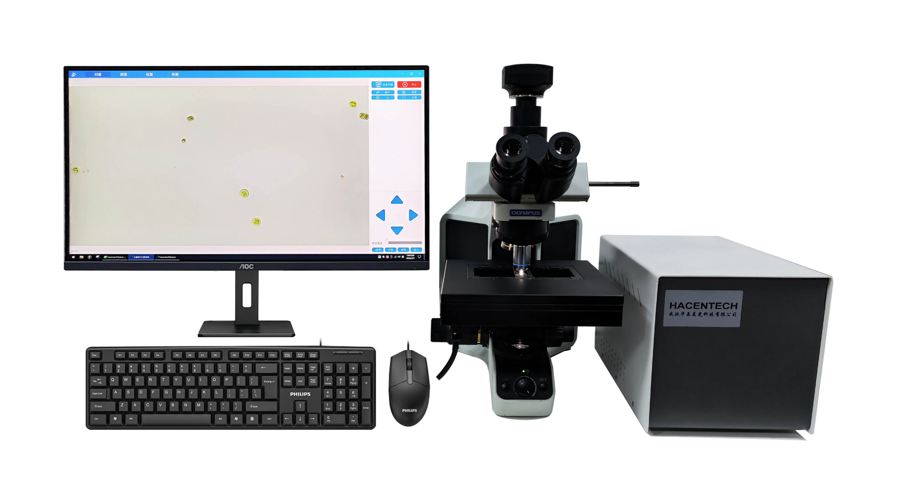
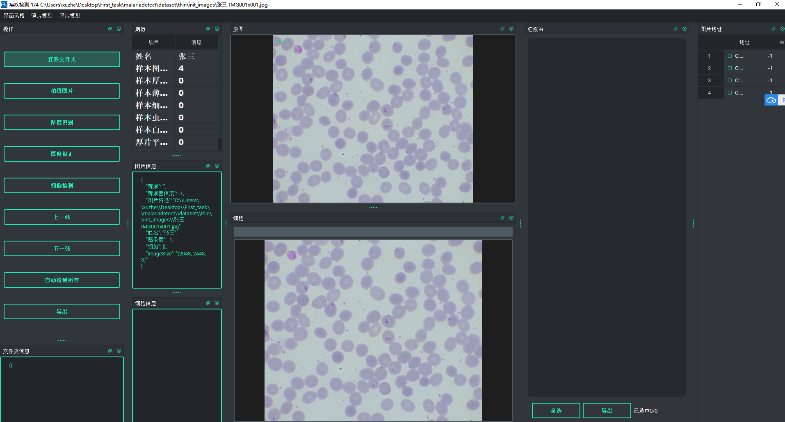

# YOLTv8_CellDetection_pyqt
一个针对超大分辨率图片检测的解决方法，可用于医学细胞检测和高分辨航拍检测等，设计了qt界面
主要工作如下：

界面部分还有OBB旋转等代码暂不公开，等明年博主毕业会公开代码

设计了一套针对超高分辨率物体检测的完整流程。包括OBB旋转框、目标分割、对应的评估指标计算，关联 跟踪算法等一整套算法流程
本文的思路借鉴了YOLT，但是YOLT是18年的算法，基础YOLOv2构建，本文代码适配v8、v9，还基于此设计了OBB旋转框，目标分割的版本，支持检测视频和目标跟踪
本文对nms算法进行了改进
针对本文的特殊思路，设计了新的iou计算方式
  

# 创建你的conda环境
conda activate YOLTv8
pip install requirement.txt
其中malaria>=1.0.5

